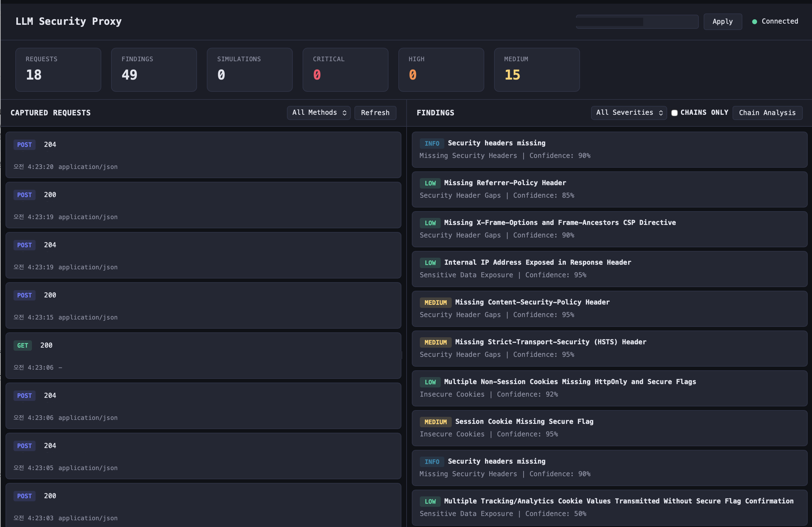

# LLM-HOOK-BROWSER

AI 기반 실시간 웹 취약점 진단 프록시. 브라우저 트래픽을 가로채 LLM(Claude)으로 자동 보안 분석을 수행합니다.

## 실행 화면



> **참고**: 실제 분석 결과에는 대상 URL 주소가 그대로 표시되지만, 위 샘플 이미지에서는 보안상 URL을 마스킹 처리한 상태입니다.

## 개요

크롬 브라우저의 프록시를 설정하면, 사용자가 웹 서핑하는 모든 HTTP/HTTPS 트래픽을 실시간으로 캡처하고 취약점을 진단합니다.

### 아키텍처

```
브라우저 (Chrome)
    ↓  프록시 (127.0.0.1:8080)
mitmproxy (HTTPS 복호화)
    ↓
SecurityInterceptor (트래픽 필터링/캡처)
    ↓
SQLite DB 저장
    ↓
2단계 분석 파이프라인
├── Stage 1: 알고리즘 사전분석 (패턴 매칭, 시그니처 탐지)
└── Stage 2: LLM 정밀분석 (Claude Sonnet via Bedrock)
    ↓
취약점 리포트 (CVSS v3.1 점수 + OWASP 매핑)
    ↓
웹 대시보드 (실시간 WebSocket)
```

### 탐지 가능 취약점 (35종)

| 카테고리 | 취약점 |
|----------|--------|
| **Injection** | SQLi, NoSQL Injection, SSTI, Command Injection, XXE, LDAP Injection, XPath Injection, CRLF, GraphQL Injection |
| **XSS** | Reflected XSS, Stored XSS, DOM XSS |
| **Access Control** | IDOR/BOLA, BFLA, Mass Assignment, Path Traversal, Privilege Escalation |
| **Authentication** | JWT 취약점 (alg:none, RS256→HS256, kid injection), OAuth, Session Fixation, Password Reset, Rate Limiting |
| **Server-Side** | SSRF (Cloud Metadata 포함) |
| **Misconfiguration** | CORS, HTTP Smuggling, Security Headers, CSRF |
| **Data Exposure** | API Key/Secret 노출, Information Disclosure, Insecure Cookies |
| **기타** | Insecure Deserialization, Open Redirect, File Upload, Race Condition, Business Logic |

## 설치

### 요구 사항

- Python 3.11+
- AWS Bedrock 또는 Anthropic API 접근 권한

### 설치 과정

```bash
# 1. 클론
git clone https://github.com/lufianlee/LLM-HOOK-BROWSER.git
cd LLM-HOOK-BROWSER

# 2. 가상환경 생성 및 의존성 설치
python3 -m venv venv
source venv/bin/activate
pip install -r requirements.txt

# 3. 환경변수 설정
cp .env.example .env
# .env 파일을 편집하여 LLM 인증 정보 입력
```

### 환경변수 설정 (.env)

```bash
# --- LLM 설정 ---
# 방법 1: AWS Bedrock (권장)
LLM_PROVIDER=bedrock
AWS_REGION=us-east-1
BEDROCK_MODEL_ID=us.anthropic.claude-sonnet-4-6

# 방법 2: Anthropic API 직접
LLM_PROVIDER=anthropic
ANTHROPIC_API_KEY=sk-ant-xxxxx
ANTHROPIC_MODEL=claude-sonnet-4-6-20250514

# --- 타겟 ---
TARGET_DOMAINS=example.com,api.example.com  # 비우면 전체 캡처

# --- 포트 ---
PROXY_PORT=8080       # 프록시 포트
API_PORT=8000         # 대시보드 포트

# --- 분석 ---
AUTO_ANALYZE=true     # 캡처 즉시 자동 분석
```

> **Bedrock Bearer Token 방식**: 호스트에 `AWS_BEARER_TOKEN_BEDROCK` 환경변수가 설정되어 있으면 자동으로 Bearer token 인증을 사용합니다.

## 사용법

### 1. 서버 시작

```bash
source venv/bin/activate
python main.py
```

출력 예시:
```
Database initialized
Ingester task started
Proxy listening on port 8080, target domains: ['example.com']
LLM provider: bedrock, model: us.anthropic.claude-sonnet-4-6
Dashboard: http://127.0.0.1:8000
HTTP(S) proxy listening at *:8080.
```

### 2. 크롬 브라우저 프록시 설정

#### 방법 A: 프록시 전용 크롬 실행 (권장)

```bash
# macOS
"/Applications/Google Chrome.app/Contents/MacOS/Google Chrome" \
  --proxy-server="http://127.0.0.1:8080" \
  --ignore-certificate-errors \
  --user-data-dir="/tmp/chrome-proxy-profile" \
  --no-first-run \
  "https://target-site.com"

# Windows
chrome.exe --proxy-server="http://127.0.0.1:8080" --ignore-certificate-errors --user-data-dir="%TEMP%\chrome-proxy"

# Linux
google-chrome --proxy-server="http://127.0.0.1:8080" --ignore-certificate-errors --user-data-dir="/tmp/chrome-proxy"
```

#### 방법 B: mitmproxy CA 인증서 설치 (HTTPS 검사용)

1. 서버 실행 후, 프록시가 설정된 브라우저에서 `http://mitm.it` 접속
2. OS에 맞는 인증서 다운로드 및 설치
3. 이후 `--ignore-certificate-errors` 없이도 HTTPS 트래픽 검사 가능

### 3. 대시보드 접속

일반 브라우저(프록시 미설정)에서:

```
http://127.0.0.1:8000
```

### 4. 수동 분석 실행

캡처된 트래픽은 `AUTO_ANALYZE=true`이면 자동 분석됩니다.
수동으로 특정 요청을 분석하려면:

```bash
# 단일 요청 분석
curl -X POST http://127.0.0.1:8000/analyze/single \
  -H "Content-Type: application/json" \
  -d '{"request_id": 1}'

# 체인 분석 (다중 요청 흐름)
curl -X POST http://127.0.0.1:8000/analyze/chain \
  -H "Content-Type: application/json" \
  -d '{"last_n": 20}'

# 공격 시뮬레이션
curl -X POST http://127.0.0.1:8000/simulate \
  -H "Content-Type: application/json" \
  -d '{"finding_id": 1}'
```

## API 엔드포인트

| Method | Path | 설명 |
|--------|------|------|
| GET | `/requests` | 캡처된 요청 목록 |
| GET | `/requests/{id}` | 요청 상세 |
| POST | `/analyze/single` | 단일 요청 취약점 분석 |
| POST | `/analyze/chain` | 체인 공격 분석 |
| GET | `/findings` | 취약점 목록 |
| GET | `/findings/{id}` | 취약점 상세 |
| POST | `/simulate` | 공격 시뮬레이션 |
| GET | `/simulations` | 시뮬레이션 결과 |
| GET | `/stats` | 통계 대시보드 |
| GET/PUT | `/config/domains` | 타겟 도메인 설정 |
| WS | `/ws` | 실시간 WebSocket |

## 분석 파이프라인

### Stage 1: 알고리즘 사전분석

LLM 호출 전, 20개 검사기가 패턴 매칭으로 빠르게 스캔합니다:

- SQL/NoSQL/Command Injection 시그니처
- XSS 반사 탐지 (컨텍스트별)
- SSTI 템플릿 표현식 탐지
- JWT 알고리즘 취약점 (alg:none, 빈 서명)
- SSRF 내부/메타데이터 URL 탐지
- Path Traversal 시퀀스
- HTTP Smuggling 이중 헤더
- CORS 오류설정
- 시크릿/키 노출 패턴 (13종)
- 보안 헤더 분석
- 기술 핑거프린팅 + WAF 탐지
- 쿠키 보안 속성, CSRF 토큰, 레이트리밋

### Stage 2: LLM 정밀분석

사전분석 힌트를 프롬프트에 주입하여 Claude Sonnet이 35개 취약점 카테고리에 대해 정밀 분석합니다.

### 후처리

- CVSS v3.1 점수 자동 산출
- OWASP Top 10 2021 매핑
- 사전분석/LLM 신뢰도 병합
- 중복 제거

## 공격 시뮬레이션

발견된 취약점에 대해 안전한 페이로드로 검증 시뮬레이션을 실행합니다:

- **200+ 내장 페이로드** (SQLi, XSS, SSTI, CMDi, XXE, SSRF, JWT, Path Traversal 등)
- 시그니처 기반 + LLM 기반 이중 검증
- WAF 차단 자동 탐지
- `safe=true` 페이로드만 실행 (안전하지 않은 것은 자동 차단)

## 프로젝트 구조

```
LLM-HOOK-BROWSER/
├── main.py                          # FastAPI 엔트리포인트
├── app/
│   ├── analyzer/
│   │   ├── engine.py                # 2단계 분석 엔진
│   │   ├── pre_analyzer.py          # 알고리즘 사전분석 (20개 검사기)
│   │   ├── payloads.py              # 공격 페이로드 DB (200+)
│   │   ├── cvss.py                  # CVSS v3.1 계산기
│   │   ├── prompts.py               # LLM 분석 프롬프트 (35종 취약점)
│   │   └── llm_client.py            # LLM 클라이언트 (Bedrock/Anthropic)
│   ├── api/
│   │   └── routes.py                # REST/WebSocket API
│   ├── proxy/
│   │   ├── interceptor.py           # mitmproxy 트래픽 가로채기
│   │   └── runner.py                # 프록시 서버 실행
│   ├── simulator/
│   │   └── attacker.py              # 공격 시뮬레이션 엔진
│   ├── static/
│   │   └── index.html               # 웹 대시보드
│   ├── config.py                    # 설정 관리
│   ├── database.py                  # SQLAlchemy 비동기 DB
│   ├── event_bus.py                 # WebSocket 이벤트
│   ├── ingester.py                  # 요청 수집 파이프라인
│   ├── models.py                    # DB 모델
│   └── schemas.py                   # Pydantic 스키마
├── requirements.txt
├── setup.sh
├── .env.example
└── .gitignore
```

## 라이선스

이 프로젝트는 **인가된 보안 테스트 및 교육 목적**으로만 사용해야 합니다.
사전 허가 없이 타인의 시스템에 대해 사용하는 것은 불법입니다.
